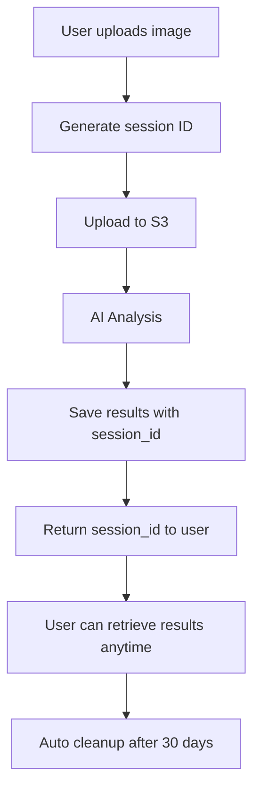

# AI Service - Anonymous User Usage Guide

## 🎯 Tính năng chính: KHÔNG CẦN ĐĂNG NHẬP

Người dùng có thể sử dụng chức năng phân tích màu da và giới tính hoàn toàn **ANONYMOUS** - không cần tạo tài khoản hay đăng nhập.

## 🔄 Workflow cho Anonymous Users



## 📋 API Endpoints for Anonymous Users

### 1. Upload & Analyze Image (No Auth Required)

```http
POST /api/v1/ai/analyze-face
Content-Type: multipart/form-data
```

**Request:**

```javascript
const formData = new FormData();
formData.append('image', file);
// sessionId is optional - will be auto-generated if not provided
formData.append('sessionId', 'optional-custom-session-id');

fetch('/api/v1/ai/analyze-face', {
  method: 'POST',
  body: formData,
})
  .then((response) => response.json())
  .then((data) => {
    console.log('Session ID:', data.sessionId);
    // Save sessionId for later retrieval
    localStorage.setItem('aiAnalysisSession', data.sessionId);
  });
```

**Response:**

```json
{
  "success": true,
  "sessionId": "sess_550e8400-e29b-41d4-a716-446655440000",
  "message": "Face analysis started successfully",
  "data": {
    "id": 123,
    "sessionId": "sess_550e8400-e29b-41d4-a716-446655440000",
    "analysisStatus": "pending"
  }
}
```

### 2. Get Analysis Results (No Auth Required)

```http
GET /api/v1/ai/analysis/result?sessionId=sess_550e8400-e29b-41d4-a716-446655440000
```

**Request:**

```javascript
const sessionId = localStorage.getItem('aiAnalysisSession');

fetch(`/api/v1/ai/analysis/result?sessionId=${sessionId}`)
  .then((response) => response.json())
  .then((data) => {
    if (data.success) {
      console.log('Gender:', data.data.detectedGender);
      console.log('Skin Tone:', data.data.detectedSkinTone);
      console.log('Confidence:', data.data.confidence);
    }
  });
```

**Response:**

```json
{
  "success": true,
  "data": {
    "sessionId": "sess_550e8400-e29b-41d4-a716-446655440000",
    "analysisStatus": "completed",
    "detectedGender": "female",
    "detectedSkinTone": "medium",
    "confidence": {
      "gender": 0.8945,
      "skinTone": 0.7821,
      "overall": 0.8383
    },
    "imageUrl": "https://s3.amazonaws.com/bucket/images/signed-url",
    "processingTime": 1850,
    "createdAt": "2025-09-12T10:30:00Z"
  },
  "message": "Analysis results retrieved successfully"
}
```

## 🔧 Frontend Implementation Example

### React Component for Anonymous Upload

```jsx
import React, { useState, useEffect } from 'react';

const AnonymousAIAnalysis = () => {
  const [file, setFile] = useState(null);
  const [sessionId, setSessionId] = useState(null);
  const [results, setResults] = useState(null);
  const [loading, setLoading] = useState(false);

  // Load existing session from localStorage
  useEffect(() => {
    const savedSession = localStorage.getItem('aiAnalysisSession');
    if (savedSession) {
      setSessionId(savedSession);
      checkResults(savedSession);
    }
  }, []);

  const uploadImage = async () => {
    if (!file) return;

    setLoading(true);
    const formData = new FormData();
    formData.append('image', file);

    try {
      const response = await fetch('/api/v1/ai/analyze-face', {
        method: 'POST',
        body: formData,
      });

      const data = await response.json();
      if (data.success) {
        setSessionId(data.sessionId);
        localStorage.setItem('aiAnalysisSession', data.sessionId);

        // Start polling for results
        pollResults(data.sessionId);
      }
    } catch (error) {
      console.error('Upload failed:', error);
    } finally {
      setLoading(false);
    }
  };

  const checkResults = async (session) => {
    try {
      const response = await fetch(
        `/api/v1/ai/analysis/result?sessionId=${session}`,
      );
      const data = await response.json();

      if (data.success && data.data.analysisStatus === 'completed') {
        setResults(data.data);
        return true;
      }
      return false;
    } catch (error) {
      console.error('Failed to get results:', error);
      return false;
    }
  };

  const pollResults = (session) => {
    const interval = setInterval(async () => {
      const completed = await checkResults(session);
      if (completed) {
        clearInterval(interval);
      }
    }, 2000); // Check every 2 seconds

    // Stop polling after 60 seconds
    setTimeout(() => clearInterval(interval), 60000);
  };

  return (
    <div className="ai-analysis-container">
      <h2>AI Face Analysis - No Login Required</h2>

      {!results && (
        <div className="upload-section">
          <input
            type="file"
            accept="image/*"
            onChange={(e) => setFile(e.target.files[0])}
          />
          <button onClick={uploadImage} disabled={!file || loading}>
            {loading ? 'Analyzing...' : 'Analyze Face'}
          </button>
        </div>
      )}

      {sessionId && !results && (
        <div className="status-section">
          <p>Analysis in progress...</p>
          <p>Session ID: {sessionId}</p>
          <small>Save this ID to check results later</small>
        </div>
      )}

      {results && (
        <div className="results-section">
          <h3>Analysis Results</h3>
          <div className="result-item">
            <strong>Gender:</strong> {results.detectedGender}
            <span className="confidence">
              ({(results.confidence.gender * 100).toFixed(1)}%)
            </span>
          </div>
          <div className="result-item">
            <strong>Skin Tone:</strong> {results.detectedSkinTone}
            <span className="confidence">
              ({(results.confidence.skinTone * 100).toFixed(1)}%)
            </span>
          </div>
          <div className="result-item">
            <strong>Processing Time:</strong> {results.processingTime}ms
          </div>

          <button
            onClick={() => {
              setResults(null);
              setSessionId(null);
              localStorage.removeItem('aiAnalysisSession');
            }}
          >
            Analyze New Image
          </button>
        </div>
      )}
    </div>
  );
};

export default AnonymousAIAnalysis;
```

## 🔒 Privacy & Security Features

### 1. No Personal Data Storage

- ❌ Không lưu tên, email, phone
- ❌ Không có user profile
- ✅ Chỉ lưu session ID và kết quả phân tích

### 2. Automatic Cleanup

- 🗑️ Xóa tự động sau 30 ngày
- 🗑️ Failed analysis xóa sau 7 ngày
- 🗑️ S3 images cũng được cleanup

### 3. Session Management

- 🔑 Session ID được generate random
- 🔑 Không thể guess được session khác
- 🔑 Session expires sau 30 ngày

## 📊 Database Queries for Anonymous Users

### Check Session Status

```sql
SELECT
  sessionId,
  analysisStatus,
  detectedGender,
  detectedSkinTone,
  createdAt
FROM face_analysis
WHERE sessionId = ?
  AND deletedAt IS NULL;
```

### Cleanup Anonymous Data

```sql
-- Cleanup old anonymous sessions
UPDATE face_analysis
SET deletedAt = NOW()
WHERE userId IS NULL
  AND createdAt < DATE_SUB(NOW(), INTERVAL 30 DAY);
```

## 🚀 Benefits of Anonymous Access

1. **Zero Friction**: Người dùng có thể thử ngay lập tức
2. **Privacy First**: Không cần cung cấp thông tin cá nhân
3. **Mobile Friendly**: Hoạt động tốt trên mobile browsers
4. **Scalable**: Có thể handle millions of anonymous requests
5. **GDPR Compliant**: Tuân thủ quy định về privacy

## ⚠️ Limitations for Anonymous Users

1. **No History**: Không có lịch sử phân tích
2. **Session Based**: Mất session_id = mất kết quả
3. **Auto Cleanup**: Data tự động xóa sau 30 ngày
4. **No Backup**: Không có backup cho anonymous data

## 🔄 Migration Path to Registered User

```javascript
// Nếu user muốn register sau này
const migrateToRegisteredUser = async (sessionId, userId) => {
  await fetch('/api/v1/ai/migrate-session', {
    method: 'POST',
    headers: {
      Authorization: `Bearer ${userToken}`,
      'Content-Type': 'application/json',
    },
    body: JSON.stringify({
      sessionId: sessionId,
      userId: userId,
    }),
  });
};
```

## 📈 Analytics for Anonymous Usage

```sql
-- Count anonymous vs registered usage
SELECT
  CASE
    WHEN userId IS NULL THEN 'Anonymous'
    ELSE 'Registered'
  END as user_type,
  COUNT(*) as total_analyses,
  AVG(processingTimeMs) as avg_processing_time
FROM face_analysis
WHERE deletedAt IS NULL
  AND createdAt >= DATE_SUB(NOW(), INTERVAL 30 DAY)
GROUP BY user_type;
```
